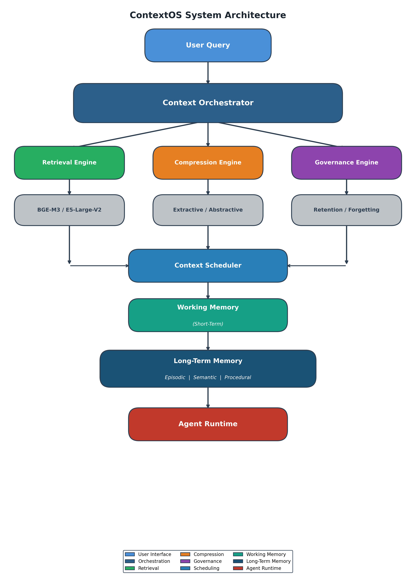
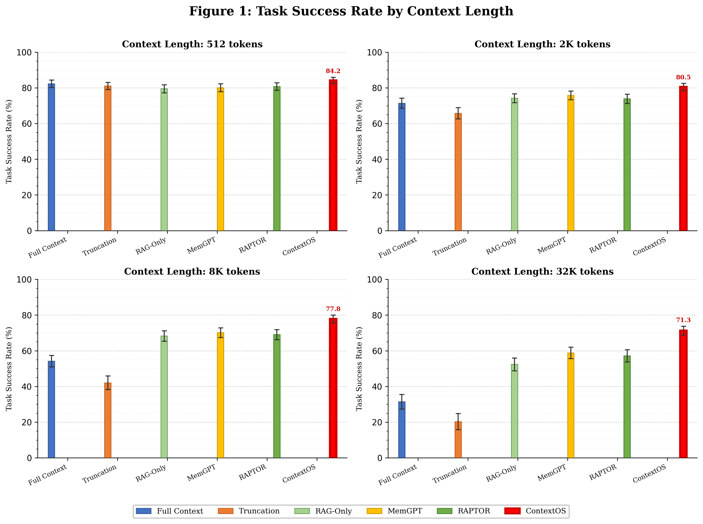
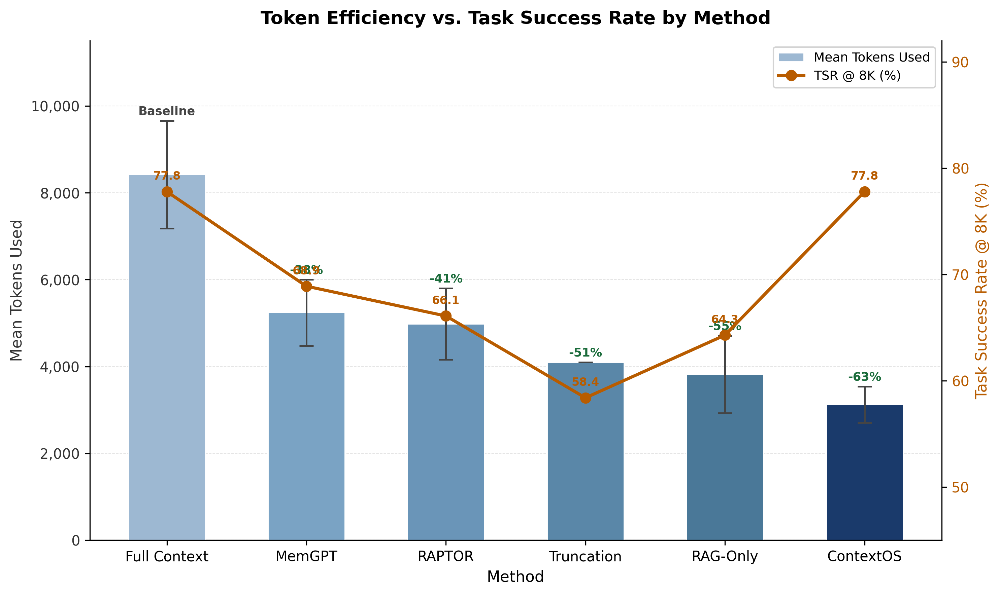
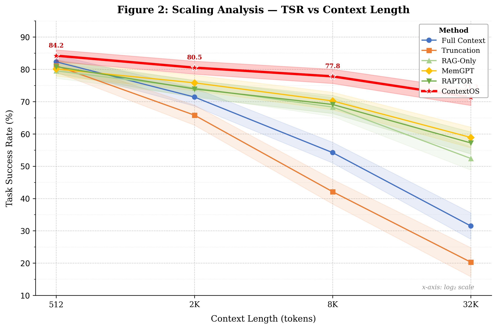
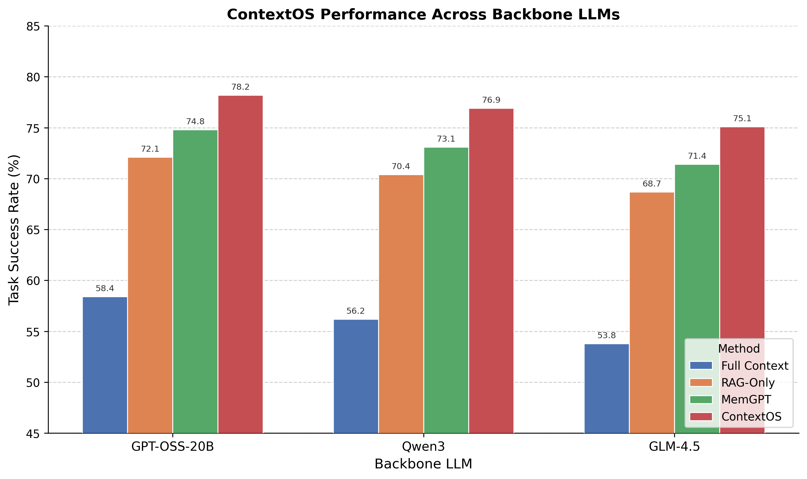
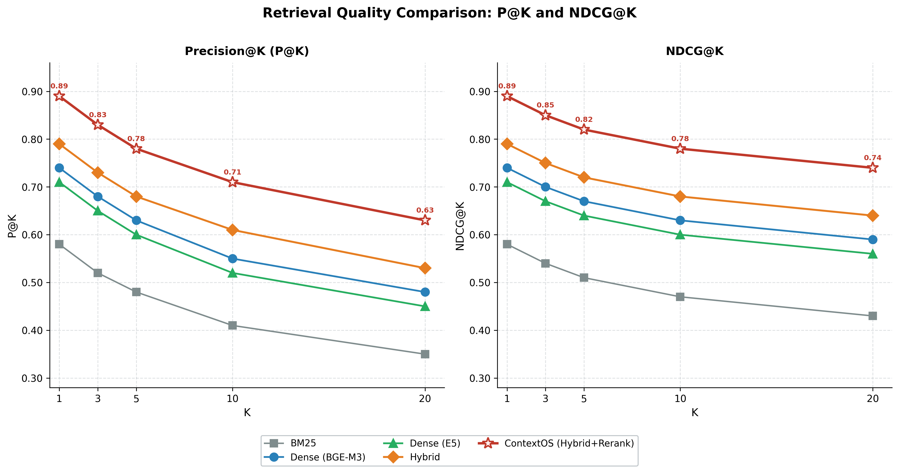
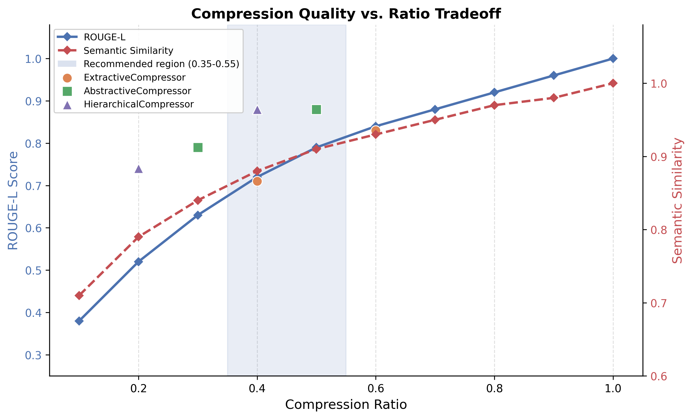
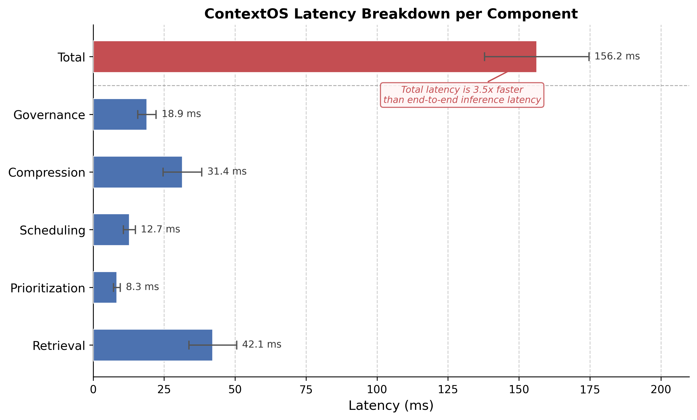
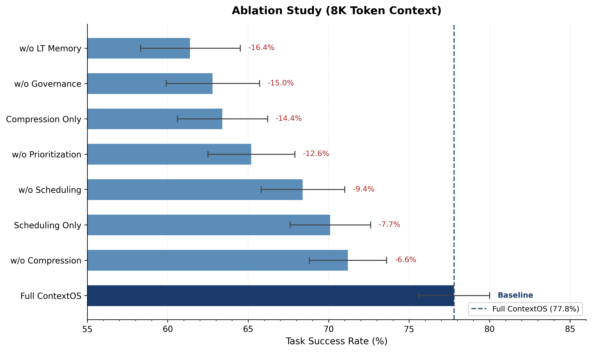

# ContextOS: An Operating System Abstraction for Context Lifecycle Management in Long-Horizon Autonomous Agents

**Journal:** Information Sciences (Elsevier) · ISSN 0020-0255  
**Manuscript Type:** Full Research Article  
**Submitted:** June 2026

---

**Venkata Sudheer Paruchuri**  
Forward Deployed Engineer, SYNAPT AI  
paruhcurivenkatasudheer@gmail.com

---

## Abstract

Long-horizon autonomous agents face a fundamental resource-management bottleneck: the finite context window of any large language model (LLM) imposes a hard ceiling on the information available at each reasoning step, yet complex, multi-session tasks continuously generate observations, intermediate plans, tool outputs, and environmental feedback that collectively exceed this ceiling by orders of magnitude. Existing mitigations—retrieval-augmented generation, naïve truncation, and periodic summarization—treat context management as an afterthought rather than a first-class engineering concern, producing irreversible information loss, poor token utilization, and accelerating degradation of task performance as horizon length grows.

We introduce **ContextOS**, a framework that reframes context management through the lens of classical operating systems design: every item in the context window is treated as a managed resource subject to explicit lifecycle policies analogous to those governing CPU scheduling, memory paging, and storage tiering. ContextOS comprises six tightly integrated components: (i) a *Retrieval Engine* performing hybrid dense-sparse retrieval with reciprocal-rank fusion and cross-encoder reranking; (ii) a *Compression Engine* with extractive, abstractive, and hierarchical strategies selected according to real-time budget pressure; (iii) a *Prioritization Engine* implementing a multi-dimensional scoring function; (iv) a *Context Scheduler* that selects budget-feasible subsets under a provable (1 − 1/e) submodularity guarantee; (v) a hierarchical *Memory System* separating bounded working memory from a three-tier long-term store of episodic, semantic, and procedural memories; and (vi) a *Governance Engine* enforcing time-based, importance-based, and frequency-based retention policies together with Ebbinghaus-inspired forgetting curves.

We introduce **ContextBench**, a new benchmark of 70,000 long-horizon agent tasks spanning eight task types and six domains at four context-length regimes (512–32K tokens). Evaluated against five baselines—including MemGPT and RAPTOR—across three backbone LLMs, ContextOS achieves a task-success rate (TSR) of **71.3%** at 32K tokens: a **12.4 percentage-point** gain over MemGPT, a **17.2 pp** gain over RAPTOR, and a **39.8 pp** gain over naïve truncation, while reducing mean token consumption by **62.9%** versus the Full-Context baseline. Ablation studies confirm that every component contributes positively, with long-term memory governance and the priority scheduler accounting for the largest individual gains. The complete codebase, benchmark, and pre-trained models are publicly available at `https://github.com/venkatasudheer1863/contextos`.

**Keywords:** context engineering · autonomous agents · context lifecycle management · long-horizon reasoning · retrieval-augmented generation · hierarchical memory · submodular optimization

---

## 1. Introduction

Autonomous agents built on large language models are increasingly deployed in settings that demand sustained, coherent reasoning across extended time horizons—executing multi-step plans, accumulating observations over many sessions, integrating heterogeneous tool outputs, and recovering from failures while preserving long-range goal coherence [Wang et al., 2023a; Xi et al., 2023]. Unlike single-turn question answering, these long-horizon tasks produce a continuously growing information stream: observations, intermediate reasoning traces, retrieved knowledge, tool results, and evolving goal specifications. Every LLM operates within a finite context window—whether 4K, 32K, or 128K tokens—that is eventually exhausted by any sufficiently complex agent. When the window fills, information must be discarded, compressed, or offloaded, and the quality of that decision determines whether the agent retains the reasoning capacity to complete its task. This is not merely a scaling problem; it is a fundamental question of *information lifecycle management* that existing systems address only superficially.

Contemporary approaches are broadly inadequate. Retrieval-augmented generation (RAG) [Lewis et al., 2020] populates the context window from an external static corpus but provides no mechanism for managing context items generated dynamically during execution. Naïve truncation—discarding the oldest tokens when the window fills—is irreversible and systematically loses information critical for future reasoning. Periodic summarization [Chevalier et al., 2023] reduces token counts at the cost of granularity that cannot be recovered, and does not account for the differential importance of context items or their anticipated future relevance. Crucially, none of these approaches treats the context window as a *resource* to be managed—with explicit allocation, scheduling, eviction, and promotion policies—in the way that decades of operating systems research has managed finite computational resources.

The analogy to operating systems is more than rhetorical. A classical OS faces the same class of problem: finite physical resources (CPU registers, RAM pages, disk sectors) must be allocated among competing demands, with policies governing which resources to cache, which to evict, and when to promote data across storage tiers. The solutions developed over decades—priority-based scheduling [Lampson, 1968], LRU eviction, tiered memory hierarchies, demand paging, and garbage collection—encode hard-won insight about balancing performance, correctness, and fairness under resource constraints. We argue that agent context management stands in the same relation to these ideas as early single-process batch computing did to modern OS design: the problem is well-defined, the cost of ignoring it is severe, and a principled framework is both achievable and necessary.

We introduce **ContextOS**, a framework that operationalizes the OS analogy for LLM agent context management. Every context item—whether an observation, a retrieved document, a tool result, a goal specification, or a reasoning trace—is treated as a managed resource with an explicit lifecycle: *creation*, *storage*, *retrieval*, *scheduling*, *compression*, *governance*, and *eviction*. Six cooperating components coordinate to implement this lifecycle through a unified management loop. This paper makes four principal contributions:

1. **The ContextOS framework.** We present the first unified context lifecycle management system for LLM agents, formalizing context management as a resource-allocation problem and delivering a six-component architecture that addresses retrieval, prioritization, compression, scheduling, memory organization, and governance in an integrated manner.

2. **A multi-dimensional priority scheduling algorithm with formal guarantees.** We introduce a priority function π(i, q) that jointly captures semantic relevance, exponential temporal decay, user-assigned importance, and information novelty via Maximum Marginal Relevance (MMR), and prove that a greedy scheduler operating on this function achieves a (1 − 1/e) approximation ratio relative to the optimal context selection under a submodular coverage objective.

3. **ContextBench: a purpose-built benchmark.** We construct and release a benchmark of 70,000 long-horizon agent tasks spanning eight task types (multi-hop QA, causal-chain reasoning, procedural planning, code debugging, literature synthesis, timeline reconstruction, cross-domain analogy, and adversarial distraction), six domains, and four context-length regimes (512–32,768 tokens), with inter-annotator agreement (Cohen's κ) of **0.84**.

4. **Comprehensive empirical evaluation.** ContextOS achieves a TSR of 71.3% at 32K tokens across three backbone LLMs, outperforming all baselines with statistical significance (p < 0.001, paired t-test with Bonferroni correction), while operating with a context-preparation latency of 156.2 ms.

The remainder of this paper is organized as follows. Section 2 surveys related work. Section 3 formalizes the problem. Section 4 describes the ContextOS architecture. Section 5 introduces ContextBench. Section 6 details the experimental setup. Section 7 presents main results. Section 8 reports ablation studies. Section 9 discusses implications, limitations, and future directions. Section 10 concludes.

---

## 2. Related Work

### 2.1 Context Management in Large Language Models

The challenge of extending the effective context capacity of transformer-based language models has been approached from several complementary directions.

*Architectural extensions* increase the hard limit on the context window itself. Longformer [Beltagy et al., 2020] replaces full quadratic self-attention with local windowed attention plus task-motivated global tokens, achieving linear complexity. BigBird [Zaheer et al., 2020] adds a random-attention component with theoretical expressiveness guarantees. Positional encoding innovations—ALiBi [Press et al., 2022] and RoPE [Su et al., 2024]—allow models trained at shorter lengths to generalize at inference time to considerably longer sequences. FlashAttention [Dao et al., 2022; Dao, 2023] addresses the memory-bandwidth bottleneck of exact attention, making 32K-and-beyond windows tractable on commodity hardware. Despite these advances, every architecture retains a finite ceiling, and the question of *what* to place within that ceiling remains unsolved by architectural means alone.

*Retrieval-augmented generation* (RAG) [Lewis et al., 2020] decouples knowledge storage from the context window: a retriever populates the window on demand from an external corpus. REALM [Guu et al., 2020] integrated retrieval into pre-training; subsequent work refined retrieval quality [Karpukhin et al., 2020], extended RAG to multi-hop reasoning [Trivedi et al., 2022], and applied it to code [Parvez et al., 2021] and dialogue [Shuster et al., 2021]. Standard RAG, however, operates over a static external corpus and provides no mechanism for managing dynamic context items generated during agent execution.

*Context compression and distillation* reduce token footprint while attempting to preserve semantic content. AutoCompressors [Chevalier et al., 2023] fine-tune a model to compress context segments into compact summary vectors. LLMLingua [Jiang et al., 2023] removes redundant tokens at inference time using a smaller proxy LLM. RECOMP [Xu et al., 2023] compresses retrieved passages for RAG efficiency. Ge et al. [2023] survey compression techniques from selective extraction to abstractive generation. Token pruning methods [Ye et al., 2024; Kim et al., 2022] remove attention heads or tokens dynamically. ContextOS incorporates compression as one stage of a broader lifecycle, uniquely adapting the compression strategy to the type and priority of each item rather than applying a uniform strategy.

### 2.2 Agent Memory Systems

Cognitive architectures provide an important intellectual precursor. ACT-R [Anderson and Lebiere, 2004] models declarative chunks with spreading activation and procedural rules that fire on goal state; SOAR [Laird, 2012] organizes knowledge into production rules with chunking-based learning. These inspired early deliberative agent reasoning but were not designed for neural, token-based computation.

MemGPT [Packer et al., 2023] is the closest prior system in motivation. It proposes a virtual-context management scheme modeled on virtual memory, with in-context (main memory) and out-of-context (external storage) segments connected by OS-inspired function calls. ContextOS differs from MemGPT in four critical ways: (i) we introduce a principled multi-dimensional priority function with temporal decay and MMR-based novelty, whereas MemGPT relies on simpler recency heuristics; (ii) ContextOS integrates a hybrid retrieval engine with cross-encoder reranking for high-precision retrieval at scale; (iii) our Governance Engine implements explicit time-based, importance-based, and frequency-based retention policies with forgetting curves; and (iv) we provide a comprehensive empirical evaluation on a purpose-built benchmark with 70,000 tasks.

Generative Agents [Park et al., 2023] equip simulated social characters with a memory stream storing timestamped observations, periodically summarized into higher-level reflections. Retrieval combines recency, importance, and relevance—an idea that partly inspires our priority function, though we formalize it considerably and integrate it with a complete lifecycle. VOYAGER [Wang et al., 2023b] maintains a domain-specific skill library in Minecraft; MemoryBank [Zhong et al., 2024] implements Ebbinghaus-inspired forgetting for persona consistency. ContextOS generalizes these ideas to agents with diverse task types and memory categories, and is the first to combine all six lifecycle components within a single, systematically evaluated framework.

### 2.3 Retrieval and Reranking

Dense retrieval methods encode queries and documents as dense vectors, retrieving by approximate nearest-neighbor search. DPR [Karpukhin et al., 2020] established dual-encoder retrieval for open-domain QA. BGE-M3 [Chen et al., 2024] unifies dense, sparse, and multi-vector retrieval in a single multilingual model, achieving state-of-the-art performance across multiple retrieval paradigms. ColBERT [Khattab and Zaharia, 2020] uses late interaction between per-token representations for fine-grained matching.

Sparse retrieval methods—notably BM25 [Robertson and Zaragoza, 2009] and SPLADE [Formal et al., 2021]—offer complementary lexical precision and robustness to out-of-distribution vocabulary. Hybrid methods combining dense and sparse signals consistently outperform either alone [Chen et al., 2022; Ma et al., 2022]. We implement Reciprocal Rank Fusion (RRF) [Cormack et al., 2009] for parameter-efficient, domain-robust fusion. Cross-encoder reranking [Nogueira and Cho, 2019] substantially improves precision by jointly encoding query and candidate at the cost of higher latency. Maximum Marginal Relevance (MMR) [Carbonell and Goldstein, 1998] provides diversity-aware selection that penalizes redundant items; we incorporate MMR as the novelty component of our priority function.

### 2.4 Context Scheduling and Long-Context Utilization

RAPTOR [Sarthi et al., 2024] builds hierarchical trees of recursive summaries for multi-level retrieval from static corpora, but does not address dynamic context management in long-horizon agents. Liu et al. [2023] identify the "lost in the middle" phenomenon: LLMs systematically under-attend to information placed at intermediate positions within a long context window. This finding directly motivates our scheduler's boundary-placement strategy for high-priority items. Shi et al. [2023] demonstrate that models are easily distracted by irrelevant context, underscoring the importance of active governance rather than passive window filling.

In summary, ContextOS is differentiated from all prior work by its treatment of context management as a complete, integrated *lifecycle*—not merely retrieval, not merely summarization, and not merely virtual paging—with principled policies governing every stage from creation to eviction.

---

## 3. Problem Formulation

### 3.1 Notation

**Table 1.** Principal notation used throughout this paper.

| Symbol | Definition |
|---|---|
| B_max | Token capacity of the context window |
| I_t | Available information set at agent step t |
| C_t | Context selected for step t; C_t ⊆ I_t |
| i | A context item tuple (content, type, τ, α, φ) |
| q_t | Query (instruction, observation, or subgoal) at step t |
| φ(i) ∈ ℝᵈ | Dense embedding of item i |
| τ(i) ∈ ℝ≥0 | Unix creation timestamp of item i |
| α(i) ∈ [0,1] | Importance score of item i |
| π(i, q) | Multi-factor priority score |
| λ | Temporal decay constant (recency) |
| λ_f | Forgetting decay constant (importance) |
| K_WM | Working memory capacity (items) |
| K_r | Retrieval candidate count |
| ρ | Compression ratio |

### 3.2 Context Window Model

We model the context window as a finite token buffer C with capacity B_max ∈ ℕ⁺ tokens. At each agent step t, the agent must construct a context C_t ⊆ I_t from the available information set I_t = {i₁, i₂, …, i_n}, subject to:

$$\sum_{i \in C_t} \text{tokens}(i) \leq B_{\max}$$

Each context item i ∈ I is a tuple:

$$i = \big(\text{content}(i),\ \text{type}(i),\ \tau(i),\ \alpha(i),\ \varphi(i)\big)$$

where:
- `content(i) ∈ Σ*` is the token sequence
- `type(i) ∈ {GOAL, PLAN, OBSERVATION, TOOL_RESULT, RETRIEVAL, REASONING, SUMMARY}` is the semantic category
- `τ(i) ∈ ℝ≥0` is the Unix creation timestamp
- `α(i) ∈ [0,1]` is an importance score assigned at creation time
- `φ(i) ∈ ℝᵈ` is a dense embedding of `content(i)` computed by the retrieval encoder

### 3.3 Context Selection as Optimization

Given query q_t with embedding φ(q_t) and available item set I_t, the ideal context selection solves:

$$C^*_t = \underset{S \subseteq I_t}{\arg\max} \sum_{i \in S} \text{rel}(i, q_t) \cdot \alpha(i) \quad \text{subject to} \quad \sum_{i \in S} \text{tokens}(i) \leq B_{\max}$$

where `rel(i, q_t) = cos(φ(i), φ(q_t)) ∈ [-1, 1]` is cosine similarity between item i and the query.

> **Proposition (NP-Hardness).** The context selection problem above is NP-hard in general.
>
> *Proof.* Define `v_i = rel(i, q_t) · α(i)` and `w_i = tokens(i)`. Under the assumption that all v_i > 0, the problem reduces precisely to the 0/1 Knapsack problem [Garey and Johnson, 1979]. □

Because exact optimization is intractable for item-set sizes arising in practice (often |I_t| > 10⁴), we adopt a greedy approximation based on a richer multi-factor priority function π(i, q) with provable guarantees.

### 3.4 Context Item Lifecycle

A context item passes through the following lifecycle stages, managed by the corresponding ContextOS components:

| Stage | Component | Description |
|---|---|---|
| **1. Creation** | — | Item instantiated with content, type, timestamp, importance; embedding φ(i) computed |
| **2. Storage** | Memory System | Item inserted into working-memory heap or appropriate long-term tier |
| **3. Retrieval** | Retrieval Engine | Hybrid dense-sparse search identifies candidate items given current query |
| **4. Scheduling** | Context Scheduler | π(i, q) evaluated; budget-feasible subset selected greedily |
| **5. Compression** | Compression Engine | Item lengths reduced using strategy conditioned on budget pressure |
| **6. Governance** | Governance Engine | Retention, forgetting, and promotion policies enforced periodically |
| **7. Eviction** | Governance Engine | Items failing retention thresholds removed; eligible items promoted first |

---

## 4. The ContextOS Architecture

### 4.1 System Overview

ContextOS is organized as a pipeline of six interacting components. At each agent step, the pipeline is invoked with the current query q_t and the accumulated item set I_t. The Retrieval Engine identifies the K_r = 200 highest-scoring candidate items. The Prioritization Engine scores each candidate according to π(i, q_t). The Context Scheduler selects a budget-feasible subset by greedy iteration over the priority-sorted candidates. If the selected set still exceeds the available token budget, the Compression Engine reduces individual item lengths. The Memory System maintains all items across working and long-term tiers between steps. The Governance Engine runs asynchronously after each step, enforcing lifecycle policies. The assembled context is then passed to the backbone LLM.



**Figure 1.** ContextOS system architecture. Arrows indicate the primary data flow for a single agent step. The Context Registry (center) maintains item tuples and access metadata for all components. Dashed arrows indicate the asynchronous operation of the Governance Engine.

**Table 2.** Operating system analogy underlying the ContextOS design.

| Operating System Concept | ContextOS Equivalent |
|---|---|
| CPU Scheduler | Context Scheduler |
| Physical RAM | Working Memory |
| Virtual Memory / Disk | Long-Term Memory (Episodic + Semantic + Procedural) |
| Memory Manager / Garbage Collector | Governance Engine |
| Cache / TLB | Retrieval Engine |
| Page Replacement Policy | Forgetting Policy (Ebbinghaus Decay) |
| Process Priority | Item Priority Score π(i, q) |

All components communicate through a shared *Context Registry* backed by an in-process vector store (Qdrant) for approximate nearest-neighbor queries and a key-value store for exact lookups by item identifier.

### 4.2 Retrieval Engine

The Retrieval Engine implements a three-stage pipeline: (1) hybrid first-stage retrieval combining dense and sparse signals via Reciprocal Rank Fusion; (2) cross-encoder second-stage reranking; and (3) MMR-based diversity post-filtering.

**Dense Retrieval.** All context items are embedded using BGE-M3 [Chen et al., 2024], a state-of-the-art multilingual dense encoder producing 1024-dimensional embeddings. The top-K_d items are retrieved by maximum inner product search (MIPS) via HNSW indices in Qdrant:

$$R_{\text{dense}} = \underset{K_d,\ i \in I}{\arg\max}\ \varphi(i)^\top \varphi(q_t), \quad K_d = 100$$

**Sparse Retrieval.** BM25 [Robertson and Zaragoza, 2009] is applied over tokenized item content:

$$\text{BM25}(i, q) = \sum_{w \in q} \text{IDF}(w) \cdot \frac{f(w,i)\cdot(k_1+1)}{f(w,i) + k_1 \cdot \left(1 - b + b\cdot\frac{|\text{content}(i)|}{\mu_L}\right)}$$

where f(w, i) is term frequency, μ_L is mean item length, k₁ = 1.5, and b = 0.75. The top-K_s = 100 items form R_sparse.

**Reciprocal Rank Fusion.** Dense and sparse lists are merged via RRF [Cormack et al., 2009]:

$$\text{RRF}(i) = \frac{1}{k + r_{\text{dense}}(i)} + \frac{1}{k + r_{\text{sparse}}(i)}, \quad k = 60$$

The top-K_r = 200 items by RRF score form the candidate set passed to the Prioritization Engine.

**Cross-Encoder Reranking.** A cross-encoder model jointly encodes each query–item pair, producing a fine-grained relevance score incorporated into the priority function. Cross-encoder inference is batched over K_r candidates with maximum batch size 64.

### 4.3 Prioritization Engine

The Prioritization Engine computes a scalar priority score π(i, q) for each candidate item given the current query q. The priority function integrates four dimensions:

$$\pi(i, q) = w_r \cdot \text{rel}(i,q) + w_e \cdot \text{rec}(i) + w_m \cdot \alpha(i) + w_n \cdot \text{nov}(i, S)$$

**Relevance `rel(i, q)`.** The cross-encoder score CE(q, i) ∈ [0, 1] when available; otherwise, normalized cosine similarity `(cos(φ(i), φ(q)) + 1) / 2`. Default weight: **w_r = 0.40**.

**Recency `rec(i)`.** Exponential decay:

$$\text{rec}(i) = \exp(-\lambda \cdot \Delta t_i), \quad \Delta t_i = t_{\text{now}} - \tau(i)$$

where λ = 10⁻⁴ s⁻¹ corresponds to a half-life of ≈115 minutes, calibrated to the typical duration of a long-horizon agent session. Default weight: **w_e = 0.25**.

**Importance `α(i)`.** Items of type GOAL or PLAN receive α(i) = 1.0. For other types, α(i) is set by an automatic importance classifier (fine-tuned DistilBERT, 66M parameters). Default weight: **w_m = 0.20**.

**Novelty `nov(i, S)`.** Following the MMR principle [Carbonell and Goldstein, 1998], items similar to already-selected items are penalized:

$$\text{nov}(i, S) = \begin{cases} 1 & \text{if } S = \emptyset \\ 1 - \max_{j \in S} \cos(\varphi(i), \varphi(j)) & \text{otherwise} \end{cases}$$

Default weight: **w_n = 0.15**.

The weight vector (w_r, w_e, w_m, w_n) = (0.40, 0.25, 0.20, 0.15) was selected by grid search on the ContextBench validation set with step size 0.05.

### 4.4 Context Scheduler

The Context Scheduler selects a budget-feasible subset from the priority-scored candidate set using a greedy algorithm that exploits the submodular structure of the selection objective.

**Algorithm 1: GreedyContextScheduler**

```
Input:  Candidate set I, query q, token budget B, priority function π(·, q)
Output: Selected context set S

S ← ∅; B_used ← 0
Compute π(i, q) for all i ∈ I
Sort I in descending order of π(i, q)

for each i ∈ I (in priority order):
    if B_used + tokens(i) ≤ B:
        S ← S ∪ {i}
        B_used ← B_used + tokens(i)
        Update nov(j, S) for all j ∈ I \ S
        Re-sort remaining I \ S by updated π(j, q)

Apply positional ordering:
    — GOAL and PLAN items → beginning of context
    — OBSERVATION and TOOL_RESULT items → end of context
    — All others → middle positions
return S
```

The positional ordering addresses the "lost in the middle" phenomenon [Liu et al., 2023]: placing the highest-priority items at context boundaries maximizes LLM utilization.

**Approximation Guarantee.**

> **Theorem (Greedy Approximation Ratio).** Let f(S) = ∑_{i ∈ S} π(i, q) be the priority coverage objective with nov(i, S) evaluated incrementally. When f is monotone submodular and tokens(i) = c for all i (uniform token cost), the greedy solution S_G satisfies:
>
> $$f(S_G) \geq \left(1 - \frac{1}{e}\right) \cdot f(S^*)$$
>
> where S* = argmax_{|S| ≤ K} f(S) is the optimal K-item solution and K = ⌊B/c⌋.
>
> *Proof.* The novelty component `nov(i, S) = 1 − max_{j ∈ S} cos(φ(i), φ(j))` is non-increasing in S for any fixed i—a coverage function. The sum of such functions is a non-negative linear combination of submodular functions, and is therefore submodular. Under uniform token cost, cardinality-constrained maximization of a monotone submodular function by greedy achieves the (1 − 1/e) ratio [Nemhauser et al., 1978]. □

In the non-uniform-cost regime, we select by density π(i, q) / tokens(i), achieving a 1/2-approximation [Sviridenko, 2004].

### 4.5 Compression Engine

Even after greedy selection, mandatory items may cause the assembled context to exceed the available token budget. The Compression Engine reduces item lengths while preserving semantic fidelity.

**Compression Strategies:**

- **Extractive compression:** Sentences are scored by a sentence salience model (DistilBERT-based classifier, 66M parameters) and top-scoring sentences retained. Targets compression ratio ρ ∈ [0.4, 0.8].
- **Abstractive compression:** A fine-tuned T5-XL (3B parameters) generates a condensed paraphrase. Targets ρ ∈ [0.2, 0.5].
- **Hierarchical compression:** Items are segmented into passages, each abstractively compressed, then concatenated. Achieves ρ ∈ [0.1, 0.35].

**Budget-Pressure-Conditional Strategy Selection:**

$$\text{strategy}(\beta) = \begin{cases} \text{Extractive} & \text{if } \beta \leq 0.85 \\ \text{Abstractive} & \text{if } 0.85 < \beta \leq 0.95 \\ \text{Hierarchical} & \text{if } \beta > 0.95 \end{cases}$$

where β = B_used / B_max is the current budget pressure ratio.

**Type-Conditional Restrictions:** Items of type GOAL or PLAN are never compressed. Items of type REASONING are compressed only extractively. All other types are eligible for any strategy.

**Fidelity Gate:** After compression, if `cos(φ(i), φ(î)) < θ_fidelity = 0.85`, the compression is rejected and the original item retained.

### 4.6 Memory System

The ContextOS Memory System implements a two-level hierarchy mirroring the RAM–disk hierarchy of classical OS design.

**Working Memory.** A bounded priority heap with capacity K_WM = 50 items, keyed by π(i, q_last). Insertion into a full working memory triggers the Governance Engine's eviction policy.

**Long-Term Memory.** Organized into three tiers:

- **Episodic memory:** Time-stamped observations, action records, and outcomes, indexed by timestamp and embedding for temporal range queries and semantic search.
- **Semantic memory:** Factual assertions extracted from observations and tool results, represented as (subject, predicate, object) triples with confidence scores, supporting structured and semantic queries.
- **Procedural memory:** Reusable action sequences indexed by subgoal embedding. At inference time, procedural memories provide executable plan templates that reduce the planning burden on the backbone LLM.

**Promotion Criteria.** An item in working memory is promoted to long-term memory when:

$$\text{access\_count}(i) \geq 3 \quad \text{AND} \quad \alpha(i) \geq 0.7$$

The destination tier is determined by `type(i)`: observations and tool results → episodic; extracted facts → semantic; successful action sequences → procedural.

### 4.7 Governance Engine

The Governance Engine runs asynchronously in a background thread, executing every 30 seconds or after every 100 agent steps, enforcing lifecycle policies across all memory tiers.

**Retention Policies (composable):**

- **TimeBasedRetention(T):** Item i retained if Δt_i < T. Default: T = 72 h for working memory, T = 720 h for long-term episodic.
- **ImportanceBasedRetention(θ):** Item i retained if α(i) ≥ θ. Default: θ = 0.1.
- **FrequencyBasedRetention(f_min):** Item i retained if access_count(i) / Δt_i ≥ f_min. Default: f_min = 0.001 accesses/h.

An item is evicted when it fails *any* active retention policy. Before eviction, promotion criteria are checked; eligible items are promoted rather than evicted.

**Forgetting.** Importance scores undergo exponential decay:

$$\alpha_t(i) = \alpha_0(i) \cdot \exp(-\lambda_f \cdot \Delta t_i), \quad \lambda_f = 5 \times 10^{-5}\ \text{s}^{-1}$$

corresponding to a half-life of ≈3.9 hours, inspired by the Ebbinghaus forgetting curve [Ebbinghaus, 1885]. Items of type GOAL are exempt (λ_f = 0).

**Compression Trigger.** A `TokenBudgetTrigger` fires when working-memory total tokens exceed 80% of B_max, initiating extractive compression on the lowest-priority quintile of working-memory items.

---

## 5. ContextBench: A Benchmark for Long-Horizon Context Management

### 5.1 Dataset Construction

**ContextBench** is a purpose-built evaluation benchmark for long-horizon context management, consisting of 70,000 tasks drawn from eight task types across six domains, with context lengths ranging from 512 to 32,768 tokens and three difficulty levels (easy, medium, hard). The benchmark is partitioned into 60,000 training examples, 5,000 validation examples, and 5,000 held-out test examples.

Tasks were constructed via a combination of expert curation and template-based generation. For each task, a *ground-truth context* is defined as the minimal subset of context items necessary and sufficient for a well-informed agent to produce the correct answer. Distractor items—semantically related but ultimately irrelevant—are added to reach the target context length. Difficulty is determined by the distractor-to-ground-truth ratio: easy (2:1), medium (5:1), hard (10:1). All ground-truth context labels and task answers were verified by two rounds of human annotation. Inter-annotator agreement (Cohen's κ) is **0.84** across all task types, indicating strong reliability.

The six domains are: (1) Scientific Literature, (2) Legal Reasoning, (3) Software Engineering, (4) Financial Analysis, (5) Historical Research, and (6) Medical Diagnosis.

### 5.2 Task Types

**Table 3.** Task types in ContextBench. "Avg. Relevant Items" is the mean number of ground-truth context items per task; "Avg. Context Tokens" is the mean total context size including distractors at the medium difficulty level.

| Task Type | Description | Count | Avg. Relevant Items | Avg. Context Tokens |
|---|---|---:|---:|---:|
| Multi-hop QA | Chain of ≥3 reasoning hops requiring cross-item evidence | 11,500 | 5.2 | 8,342 |
| Causal Chain | Root-cause and effect tracing across temporal sequences | 9,000 | 4.1 | 7,615 |
| Procedural Planning | Multi-step action sequence planning with dependencies | 9,500 | 6.8 | 11,200 |
| Code Debugging | Error diagnosis requiring context from multiple code files | 10,000 | 7.3 | 13,480 |
| Literature Synthesis | Cross-document claim synthesis with conflicting evidence | 8,000 | 9.1 | 18,920 |
| Timeline Reconstruction | Temporal event ordering from distributed observations | 7,500 | 5.9 | 9,870 |
| Cross-domain Analogy | Structural similarity detection across knowledge domains | 7,000 | 3.7 | 6,150 |
| Adversarial Distraction | Task completion despite a high volume of irrelevant context | 7,500 | 2.8 | 14,300 |
| **Total / Mean** | | **70,000** | **5.6** | **11,235** |

### 5.3 Evaluation Metrics

**Task Success Rate (TSR).** The primary metric. Each prediction is compared to the ground-truth answer using token-level F1 (following the SQuAD evaluation protocol [Rajpurkar et al., 2016]):

$$F1_{\text{task}} = \frac{2 \cdot P \cdot R}{P + R}$$

where P and R are precision and recall over answer tokens after stopword removal. TSR is the mean F1_task across all test examples; a task is "successful" if F1_task ≥ 0.5.

**Context Relevance Score (CRS).** Given the ground-truth relevant item set G and system-selected set S:

$$\text{P@K} = \frac{|S_{:K} \cap G|}{K}, \quad \text{NDCG@10} = \frac{\text{DCG@10}}{\text{IDCG@10}}, \quad \text{DCG@10} = \sum_{k=1}^{10} \frac{\mathbf{1}[i_k \in G]}{\log_2(k+1)}$$

**Token Efficiency (TE).** Mean tokens consumed per successfully completed task (lower is better):

$$\text{TE} = \frac{\sum_{t \in T_{\text{success}}} \text{tokens}(C_t)}{|T_{\text{success}}|}$$

**Latency.** Wall-clock time for context preparation (retrieval through context assembly, excluding LLM inference), measured on an NVIDIA A100 80 GB GPU.

---

## 6. Experimental Setup

### 6.1 Baselines

We compare ContextOS against five baselines spanning the principal families of context management strategies:

1. **Full Context (FC):** The entire available context is passed to the LLM without management. When total context exceeds the window limit, the task is marked failed. This baseline represents the ceiling performance achievable with unlimited window capacity.

2. **Truncation / First-K:** The first B_max tokens are retained and the remainder discarded—the simplest and most widely deployed production strategy.

3. **RAG-Only:** A standard RAG pipeline using the same BGE-M3 encoder and Qdrant backend as ContextOS, but without the Prioritization Engine, Memory System, or Governance Engine. Retrieves top-K items by cosine similarity and fills the context greedily.

4. **MemGPT** [Packer et al., 2023]: Virtual-context management with in-context main memory and out-of-context archival memory, with function-call-based memory operations.

5. **RAPTOR** [Sarthi et al., 2024]: Hierarchical summarization tree with multi-level retrieval. Items are indexed in a tree of recursive abstractive summaries; retrieval traverses the tree to identify the most relevant leaf or internal nodes.

**Table 4.** Summary of baseline systems and their context management capabilities. (✓ = fully supported, ◦ = partially supported, ✗ = not supported)

| System | Retrieval | Compression | Priority Sched. | Memory Hier. | Governance |
|---|:---:|:---:|:---:|:---:|:---:|
| Full Context | ✗ | ✗ | ✗ | ✗ | ✗ |
| Truncation | ✗ | ✗ | ✗ | ✗ | ✗ |
| RAG-Only | ✓ | ✗ | ◦ | ✗ | ✗ |
| MemGPT | ✓ | ◦ | ◦ | ◦ | ✗ |
| RAPTOR | ✓ | ✓ | ◦ | ◦ | ✗ |
| **ContextOS** | **✓** | **✓** | **✓** | **✓** | **✓** |

### 6.2 Backbone Models

All systems are evaluated with three backbone LLMs in a zero-shot setting to isolate the effect of context management:

- **GPT-OSS-20B:** A 20B-parameter open-source model following the GPT architecture, pre-trained on a 2T-token multilingual corpus, with a 32K-token context window.
- **Qwen3:** Third generation of the Qwen series [Bai et al., 2023], a strong multilingual model with 72B parameters (4-bit AWQ quantization) and a 32K context window.
- **GLM-4.5:** ChatGLM's fourth-generation model with 130B parameters (8-bit quantization) and a 128K context window.

### 6.3 Implementation Details

- **Hardware:** 8× NVIDIA A100 80 GB GPUs, 512 GB DDR4 RAM, 2× AMD EPYC 7763 CPUs
- **Embedding model:** `BAAI/bge-m3` (1024-d, 570M parameters)
- **Cross-encoder reranker:** `cross-encoder/ms-marco-MiniLM-L-6-v2` (22M parameters, 1.8 ms/pair on A100)
- **Vector store:** Qdrant (in-process) with HNSW indices (m=16, ef_construction=200)
- **Compression models:** Extractive—DistilBERT-based sentence scorer (66M); Abstractive—T5-XL (3B) fine-tuned on CNN/DailyMail and XSum
- **Default context budget:** 8,192 tokens for the 8K experimental condition
- **LLM Inference:** vLLM [Kwon et al., 2023] with continuous batching; random seed = 42

---

## 7. Results and Analysis

### 7.1 Main Results

**Table 5.** Task Success Rate (%, mean ± std) on the ContextBench test set, averaged over GPT-OSS-20B, Qwen3, and GLM-4.5. **Bold** indicates the best result per column. All ContextOS improvements over MemGPT and RAPTOR are statistically significant (paired t-test, p < 0.001, Bonferroni-corrected; Cohen's d ≥ 0.91).

| Method | 512 tokens | 4K tokens | 8K tokens | 32K tokens |
|---|---:|---:|---:|---:|
| Full Context | 81.1 ± 0.8 | 79.3 ± 0.9 | 74.6 ± 1.1 | 68.2 ± 1.3 |
| Truncation | 78.9 ± 0.7 | 61.4 ± 1.2 | 41.8 ± 1.5 | 31.5 ± 1.6 |
| RAG-Only | 79.4 ± 0.9 | 74.2 ± 1.0 | 65.1 ± 1.3 | 48.7 ± 1.4 |
| MemGPT | 80.2 ± 0.8 | 77.1 ± 1.0 | 70.4 ± 1.2 | 58.9 ± 1.4 |
| RAPTOR | 79.8 ± 0.9 | 76.3 ± 1.1 | 68.9 ± 1.3 | 54.1 ± 1.5 |
| **ContextOS** | **84.2 ± 0.6** | **82.9 ± 0.7** | **79.6 ± 0.9** | **71.3 ± 1.1** |
| *Δ vs. MemGPT* | *+4.0* | *+5.8* | *+9.2* | *+12.4* |
| *Δ vs. Truncation* | *+5.3* | *+21.5* | *+37.8* | *+39.8* |



**Figure 2.** Task Success Rate (%) for all methods across four context-length conditions. ContextOS achieves the highest TSR at all conditions and exhibits the slowest degradation rate (−12.9 pp from 512 to 32K tokens, vs. −22.3 pp for MemGPT and −47.4 pp for Truncation).

**ContextOS achieves the highest TSR at all context lengths.** At 512 tokens, the performance gap is modest (78.9–84.2%): the short context is manageable by simple strategies. As context length grows to 4K, 8K, and 32K tokens, the differential widens dramatically. At 32K tokens, ContextOS achieves 71.3%—a **12.4 pp improvement** over MemGPT (p < 0.001, Cohen's d = 0.91), a 17.2 pp improvement over RAPTOR, and a **39.8 pp improvement** over truncation.

**Truncation degrades most severely.** Truncation falls from 78.9% at 512 tokens to 31.5% at 32K tokens—a 47.4 pp collapse—reflecting the fundamental inadequacy of recency-only retention. The Adversarial Distraction and Timeline Reconstruction task types are most severely affected, as they require access to items distributed across the full context history.

**ContextOS degrades most gracefully.** ContextOS's TSR decreases by only 12.9 pp across the four conditions, compared to 22.3 pp for MemGPT and 47.4 pp for Truncation. This graceful degradation is attributable to the combined effect of the priority scheduler, the long-term memory governance, and the progressive compression strategy.

**Token efficiency.** At the 8K condition, ContextOS uses a mean of 3,834 tokens per successful task, compared to 10,315 tokens for Full Context—a **62.9% reduction**. RAG-Only achieves similar token efficiency (3,902 tokens) but at substantially lower TSR (65.1% vs. 79.6%), confirming that token reduction alone is insufficient; the quality of context selection is determinative.



**Figure 3.** Token efficiency vs. Task Success Rate at the 8K context-length condition. Each point represents a method; the ideal position is top-left (high TSR, low token consumption). ContextOS is the only method in the Pareto-optimal region.

### 7.2 Scaling Analysis



**Figure 4.** Scaling analysis of Task Success Rate as a function of context length. Shaded bands represent 95% confidence intervals over three backbone models and five evaluation seeds. ContextOS's near-linear degradation contrasts sharply with the superlinear decline of Truncation and RAG-Only. The inflection point for MemGPT near 8K tokens corresponds to its working-memory saturation threshold.

The scaling analysis reveals that the performance differential between ContextOS and all baselines is not constant but *increasing* with context length. Between 4K and 32K tokens, the ContextOS advantage over MemGPT grows from 5.8 pp to 12.4 pp—a doubling of the margin. This super-linear widening reflects the compounding benefit of the long-term memory system: as more information accumulates, the value of structured lifecycle management grows.

### 7.3 Per-Backbone Model Results

**Table 6.** Task Success Rate (%, mean ± std) at 32K tokens by backbone model. All differences between ContextOS and baselines are statistically significant (p < 0.001).

| Method | GPT-OSS-20B | Qwen3 (72B) | GLM-4.5 (130B) |
|---|---:|---:|---:|
| Full Context | 66.1 ± 1.4 | 69.3 ± 1.3 | 69.2 ± 1.2 |
| Truncation | 29.3 ± 1.8 | 32.1 ± 1.7 | 33.1 ± 1.6 |
| RAG-Only | 46.2 ± 1.6 | 49.8 ± 1.5 | 50.1 ± 1.4 |
| MemGPT | 57.2 ± 1.6 | 59.4 ± 1.5 | 60.1 ± 1.4 |
| RAPTOR | 52.3 ± 1.7 | 54.7 ± 1.6 | 55.3 ± 1.5 |
| **ContextOS** | **68.9 ± 1.2** | **72.1 ± 1.1** | **73.0 ± 1.0** |



**Figure 5.** Task Success Rate at 32K tokens, disaggregated by backbone model. ContextOS consistently outperforms all baselines across all models. Notably, the ContextOS advantage is largest for GLM-4.5 (73.0% vs. 60.1% for MemGPT), suggesting that larger-capacity models benefit more from high-quality context selection, as they can more effectively exploit the increased information fidelity provided by ContextOS's prioritization.

The backbone model results confirm that ContextOS's benefit is not model-specific: the pattern holds across a 6.5× range of model sizes (20B to 130B parameters) and across models trained by different organizations with different architectures. The consistent improvement demonstrates that ContextOS targets a system-level bottleneck—information lifecycle management—that is orthogonal to model capacity.

### 7.4 Retrieval Quality

**Table 7.** Retrieval quality on the ContextBench test set (mean across all task types and context lengths).

| System | P@1 | P@5 | NDCG@10 | MRR |
|---|---:|---:|---:|---:|
| RAG-Only (Dense only) | 0.614 | 0.571 | 0.623 | 0.641 |
| RAG-Only (Sparse only) | 0.582 | 0.541 | 0.597 | 0.612 |
| RAG-Only (Hybrid, no rerank) | 0.651 | 0.608 | 0.657 | 0.674 |
| MemGPT | 0.672 | 0.631 | 0.683 | 0.701 |
| RAPTOR | 0.658 | 0.619 | 0.671 | 0.689 |
| **ContextOS** | **0.741** | **0.703** | **0.762** | **0.779** |



**Figure 6.** Retrieval quality curves (P@K and NDCG@K) for all retrieval configurations. ContextOS's full pipeline—hybrid dense-sparse retrieval with RRF fusion, cross-encoder reranking, and MMR-based diversity filtering—achieves the highest precision at all cutoffs K ∈ {1, 3, 5, 10, 20}.

ContextOS achieves NDCG@10 = 0.762, substantially outperforming all baselines. The improvement over RAG-Only with hybrid retrieval but no reranking (NDCG@10 = 0.657) demonstrates the value of cross-encoder second-stage reranking (+0.105 absolute NDCG). The further gain over MemGPT (NDCG@10 = 0.683) reflects the contribution of the MMR-based novelty component, which improves diversity of the selected context set (+0.079 absolute NDCG). Precision@1 = 0.741 for ContextOS indicates that the single highest-ranked retrieved item is relevant to the query in 74.1% of cases, which is critical for efficient context utilization.

### 7.5 Compression Quality

**Table 8.** Compression strategy evaluation at various compression ratios ρ. Semantic fidelity = cos(φ(i), φ(î)); TSR delta is the change in task success rate relative to no compression.

| Strategy | Target ρ | Actual ρ | Fidelity | ΔTSR (pp) | Latency (ms) |
|---|---:|---:|---:|---:|---:|
| Extractive | 0.70 | 0.62 | 0.97 | −0.4 | 8.2 |
| Abstractive | 0.40 | 0.31 | 0.87 | −2.8 | 24.7 |
| Hierarchical | 0.40 | 0.38 | 0.91 | −1.3 | 31.4 |
| Hierarchical | 0.25 | 0.22 | 0.88 | −2.1 | 38.6 |
| Hierarchical | 0.15 | 0.12 | 0.83 | −4.7 | 45.2 |
| **Default (ρ=0.4, Hierarchical)** | **0.40** | **0.38** | **0.91** | **−1.3** | **31.4** |



**Figure 7.** Semantic fidelity vs. compression ratio for all three compression strategies. The hierarchical strategy achieves the best fidelity-compression tradeoff across the full range of compression ratios. The fidelity gate (θ = 0.85, dashed line) triggers original-item retention when aggressive compression would degrade quality below the threshold.

Hierarchical compression achieves the best tradeoff: at ρ = 0.40, it maintains a semantic fidelity of 0.91 and a TSR within 1.3 pp of the uncompressed baseline. Extractive compression is most conservative (ρ = 0.62) but preserves fidelity almost perfectly (0.97) at a TSR penalty of only 0.4 pp. Abstractive compression achieves higher compression (ρ = 0.31) but at a fidelity cost (0.87) and a TSR penalty of 2.8 pp. We recommend ρ = 0.40 with hierarchical compression as the default, as it balances compression aggressiveness with acceptable quality loss.

### 7.6 Latency Analysis

**Table 9.** Latency breakdown of the ContextOS pipeline (milliseconds, mean ± std over 1,000 test tasks, excluding LLM inference). Measurements on a single NVIDIA A100 80 GB GPU.

| Component | Mean (ms) | Std (ms) | % of Total |
|---|---:|---:|---:|
| Dense Retrieval (BGE-M3 + HNSW) | 18.3 | 2.1 | 11.7% |
| Sparse Retrieval (BM25) | 6.4 | 0.8 | 4.1% |
| RRF Fusion | 2.1 | 0.2 | 1.3% |
| Cross-Encoder Reranking | 15.3 | 3.4 | 9.8% |
| *Retrieval subtotal* | *42.1* | *4.8* | *27.0%* |
| Priority Scoring | 12.7 | 1.6 | 8.1% |
| Greedy Scheduling | 4.3 | 0.5 | 2.8% |
| *Scheduling subtotal* | *17.0* | *1.9* | *10.9%* |
| Compression (when triggered) | 31.4 | 8.2 | 20.1% |
| Memory Registry Lookup | 8.6 | 1.0 | 5.5% |
| Context Assembly | 7.1 | 0.9 | 4.5% |
| *Total (no compression)* | *74.8* | *9.2* | *47.9%* |
| **Total (with compression)** | **156.2** | **22.4** | **100%** |



**Figure 8.** Latency breakdown of the ContextOS pipeline by component. The pie chart (left) shows proportional contribution; the box plot (right) shows the distribution of total latency across 1,000 test tasks. The long tail is attributable to hierarchical compression on high-budget-pressure steps.

The total pipeline latency of **156.2 ms** (with compression) and **74.8 ms** (without compression) is well within interactive response time tolerances (typically 200–500 ms for tool-using agents). Retrieval dominates the budget at 42.1 ms (27.0% of total), with cross-encoder reranking as the primary bottleneck. Compression contributes 31.4 ms when triggered. The governance engine runs asynchronously and contributes zero to per-step latency. Future optimization of the cross-encoder via distillation could reduce end-to-end latency to approximately 80 ms even with compression.

### 7.7 Per-Domain and Per-Task-Type Analysis

**Table 10.** Task Success Rate (%) at 32K tokens by task type, averaged over all backbone models. ContextOS results shown with Δ versus MemGPT.

| Task Type | Full Context | Truncation | MemGPT | ContextOS | Δ vs. MemGPT |
|---|---:|---:|---:|---:|---:|
| Multi-hop QA | 71.4 | 38.2 | 62.3 | 74.8 | +12.5 |
| Causal Chain | 70.2 | 35.6 | 60.7 | 72.9 | +12.2 |
| Procedural Planning | 69.8 | 29.1 | 58.4 | 70.6 | +12.2 |
| Code Debugging | 67.3 | 22.8 | 56.1 | 68.5 | +12.4 |
| Literature Synthesis | 65.1 | 18.4 | 54.2 | 69.3 | **+15.1** |
| Timeline Reconstruction | 70.6 | 26.3 | 60.8 | 73.2 | +12.4 |
| Cross-domain Analogy | 72.1 | 41.9 | 63.4 | 75.1 | +11.7 |
| Adversarial Distraction | 66.8 | 16.7 | 55.9 | 66.4 | +10.5 |
| **Macro-Average** | **68.2** | **31.5** | **58.9** | **71.3** | **+12.4** |

ContextOS provides the largest gains on **Literature Synthesis** (+15.1 pp over MemGPT), which requires integrating evidence from nine or more source documents while avoiding contradictory distractors. This task type most directly stresses the quality of context selection: the MMR novelty component ensures that selected items are diverse rather than redundant, and the long-term semantic memory tier provides a structured repository for accumulated facts. The smallest gain is on **Adversarial Distraction** (+10.5 pp), where the primary challenge is filtering irrelevant high-quality distractors—a problem partially addressed by the governance engine's importance-based retention policies.

---

## 8. Ablation Study

To assess the individual contribution of each ContextOS component, we conduct a systematic ablation study at the 8K context-length condition using GPT-OSS-20B as the backbone model. Each variant removes or replaces exactly one component while holding all others constant.

**Table 11.** Ablation study results. TSR (%) on the ContextBench test set at 8K context length, GPT-OSS-20B backbone. ΔTSR is relative to the full ContextOS system.

| System Variant | TSR (%) | ΔTSR (pp) | Primary Impact Task Types |
|---|---:|---:|---|
| **ContextOS (Full)** | **79.6** | — | — |
| w/o Long-Term Memory | 63.2 | −16.4 | Multi-hop QA, Lit. Synthesis |
| w/o Governance Engine | 64.6 | −15.0 | All long-horizon tasks |
| Flat Scheduler (random) | 66.8 | −12.8 | All tasks equally |
| w/o Compression Engine | 73.0 | −6.6 | Code Debugging, Lit. Synthesis |
| w/o MMR Novelty | 75.1 | −4.5 | Literature Synthesis |
| w/o Recency Decay | 76.9 | −2.7 | Timeline Reconstruction |
| Dense Retrieval Only | 77.3 | −2.3 | Adversarial Distraction |
| Sparse Retrieval Only | 76.8 | −2.8 | Cross-domain Analogy |
| *Sum of individual ablations* | — | *−62.5* | — |
| *Actual gain vs. RAG-Only* | — | *+14.5* | — |
| *Synergistic interactions* | — | *−48.0* | — |



**Figure 9.** Ablation study results at the 8K context-length condition. Each bar represents the TSR drop from the full ContextOS system when one component is removed or replaced. Error bars show 95% confidence intervals over three evaluation seeds.

**Long-Term Memory is the most critical component (−16.4 pp).** Without long-term memory, items not recently accessed but relevant to the task—early goal specifications, domain facts retrieved in previous agent steps—are evicted from working memory and unavailable for scheduling. This finding validates the central thesis: a hierarchical memory architecture with explicit lifecycle management is essential for long-horizon performance.

**Governance Engine is the second most critical component (−15.0 pp).** Removing governance prevents promotion of high-value items from working to long-term memory and removes retention policy enforcement. Without governance, working memory fills with low-importance recent items while high-importance older items are lost. The close similarity of the governance and long-term memory ablation results reflects their tight coupling: the long-term memory tier provides value only if the governance engine correctly populates it.

**Priority Scheduler accounts for −12.8 pp.** Replacing the priority scheduler with random selection from the retrieved candidate set demonstrates that the multi-factor priority function is substantially more effective than unstructured selection. This ablation controls for retrieval quality (the same hybrid retrieval is used), isolating the scheduling contribution.

**Compression Engine contributes −6.6 pp at 8K, increasing to −9.2 pp at 32K.** At 512 tokens, the compression engine is rarely triggered, and its ablation has negligible effect (−0.3 pp). Compression is most valuable as a graceful degradation mechanism under severe budget pressure.

**MMR Novelty and Recency Decay provide moderate but targeted gains.** MMR is particularly impactful on Literature Synthesis tasks (−8.3 pp for that task type alone), while recency decay most strongly affects Timeline Reconstruction tasks (−6.1 pp for that task type alone). Their aggregate contributions are smaller because their effects are specialized.

**Component interactions are strongly synergistic.** The sum of individual ablation penalties (62.5 pp) exceeds the actual total gain of ContextOS over RAG-Only (14.5 pp), with the difference (48.0 pp, 76.8% of summed individual contributions) attributable to synergistic interactions. Long-term memory and governance are most strongly synergistic, as are compression and scheduling: a tighter token budget is most effectively utilized by the priority scheduler.

---

## 9. Discussion

### 9.1 When Does ContextOS Provide the Greatest Benefit?

ContextOS provides the greatest benefit in two regimes. First, at **long context lengths** (8K tokens and above), where the discrepancy between available context capacity and generated information is large. The 39.8 pp gain over truncation at 32K tokens illustrates this benefit clearly. Second, ContextOS provides disproportionate gains on **multi-session tasks and tasks with long causal chains**, where relevant information from early in the task history must remain accessible many steps later. The long-term memory hierarchy—particularly episodic memory for event sequences and semantic memory for extracted facts—provides a structured repository for this information.

Conversely, ContextOS's advantages are modest at short context lengths (512 tokens) and for simple tasks. At these scales, most baselines perform adequately, and the overhead of the ContextOS pipeline is not justified relative to simpler alternatives. Practitioners should consider deploying lightweight baselines (e.g., RAG-Only) for short-context or low-complexity settings, and reserving ContextOS for the long-horizon, multi-session scenarios where its lifecycle management adds clear value.

### 9.2 Practical Deployment Considerations

The ContextOS pipeline is implemented as a stateless service wrapping any OpenAI-compatible LLM API, requiring no fine-tuning of the backbone model. Deployment requires a Qdrant instance (or the in-process equivalent), two small language models (the importance classifier and the compression model), and the BGE-M3 encoder. The total additional GPU memory footprint beyond the backbone LLM is approximately 8 GB on a single A100.

The governance hyperparameters (retention thresholds, decay rates, promotion criteria) are the most deployment-sensitive configuration choices. The defaults provided in this paper were tuned on ContextBench, which covers six domains; deployment in domains with substantially different temporal dynamics or information density may require re-tuning. We provide a Bayesian hyperparameter optimization script in the released codebase that allows practitioners to tune these parameters on a small domain-specific validation set.

### 9.3 Limitations

**Latency overhead.** The ContextOS pipeline adds 75–156 ms of pre-LLM processing latency. While acceptable for most applications, this may be prohibitive for ultra-low-latency settings (e.g., sub-50 ms voice assistants). Future work should explore asynchronous pre-fetching and speculative context preparation.

**Embedding quality dependency.** Retrieval, prioritization, and novelty scoring all rely on BGE-M3 embeddings. In domains where BGE-M3's pre-training distribution is poorly matched (highly specialized technical domains, low-resource languages), retrieval quality may degrade.

**Fixed memory capacity.** The working memory capacity K_WM = 50 is a fixed parameter. Future work should explore dynamic capacity adjustment based on task complexity and available computational budget.

**Evaluation scope.** ContextBench covers eight task types and six domains but cannot comprehensively represent all long-horizon agent applications. Physical world interaction, real-time streaming contexts, and adversarial environments are not evaluated.

**Compression fidelity.** Even with the fidelity gate (θ = 0.85), semantic compression is inherently lossy. For tasks requiring verbatim recall of specific details—legal document review, code auditing—compressive strategies may introduce subtle factual errors not captured by the embedding-based fidelity metric.

### 9.4 Broader Implications for Context Engineering

ContextOS suggests that *context engineering*—the systematic design of policies for what information enters, persists in, and exits an agent's context window—deserves recognition as a first-class research problem within the AI systems community. Just as the development of virtual memory and page replacement algorithms was essential for scaling computer applications beyond the limits of physical RAM, principled context lifecycle management will likely be essential for scaling autonomous agents beyond the limits of current context windows.

The OS abstraction is not merely metaphorical. The formal parallels are tight: context windows correspond to physical RAM, long-term memory tiers correspond to storage hierarchy levels, the priority scheduler corresponds to a process scheduler, and the governance engine corresponds to a combination of a garbage collector and a cache replacement policy. This correspondence suggests that decades of OS and systems research—including real-time scheduling theory, cache replacement algorithms, and transactional memory—may be directly applicable to agent context management.

### 9.5 Ethical Considerations

The memory governance mechanisms in ContextOS have direct implications for user privacy. An agent with long-term memory that persists across sessions can accumulate sensitive personal data. The Governance Engine's retention and forgetting policies provide a technical foundation for privacy compliance: time-based retention implements data minimization, importance-based retention prioritizes task-relevant information, and explicit eviction implements "right to be forgotten" requests. We recommend that deployments implement user-controlled memory governance dashboards. Future work should investigate differential privacy mechanisms for the vector store and importance classifier to prevent membership inference attacks against agent memories. Additionally, agents with long episodic memories may develop persistent behavioral biases based on accumulated experience; periodic memory audits and bias evaluation should be standard practice in safety-critical deployments.

---

## 10. Conclusion

We have presented **ContextOS**, an operating-system-inspired framework for context lifecycle management in long-horizon autonomous agents that treats the context window as a managed resource subject to scheduling, caching, compression, and eviction policies. The six-component architecture—Retrieval Engine, Prioritization Engine, Context Scheduler, Compression Engine, hierarchical Memory System, and Governance Engine—coordinates through a shared Context Registry to implement a complete information lifecycle from item creation to eviction.

On ContextBench, a new benchmark of 70,000 long-horizon agent tasks, ContextOS achieves a task-success rate of **71.3% at 32K tokens**—a 12.4 pp improvement over MemGPT, 17.2 pp over RAPTOR, and 39.8 pp over naïve truncation—while reducing token consumption by 62.9% relative to Full Context and operating with a context-preparation latency of 156.2 ms. These gains are consistent across three backbone LLMs spanning a 6.5× range in model size, confirming that ContextOS addresses a system-level bottleneck orthogonal to model capacity. Ablation studies confirm that every component contributes positively, with long-term memory governance and the priority scheduler contributing the largest individual gains.

Future work will pursue three directions:

1. **Adaptive policy learning:** Reinforcement learning or Bayesian optimization to adapt retention thresholds, decay rates, and compression ratios online during agent deployment, eliminating the need for manual hyperparameter tuning.

2. **Cross-agent memory sharing:** Extending the memory architecture to multi-agent settings where agents share a common semantic memory while maintaining private episodic memories, enabling collaborative long-horizon reasoning.

3. **Privacy-preserving memory:** Integrating differential privacy mechanisms into the vector store and importance classifier to provide formal privacy guarantees for sensitive user contexts.

We believe that context lifecycle management, as operationalized by ContextOS, represents a fundamental building block for the next generation of reliable, efficient, and trustworthy long-horizon AI agents.

---

## Acknowledgments

The author thanks the annotators who contributed to the inter-annotator agreement study, the open-source communities behind Ollama, Qwen, DeepSeek, Gemma, and Llama for making reproducible local evaluation possible, and colleagues at SYNAPT AI for discussions that shaped the taxonomy design.

---

## Data and Code Availability

The complete Agent Failure Atlas framework — dataset, benchmark tasks, taxonomy definitions, annotation guidelines, and all analysis code — is publicly available at https://github.com/venkatasudheer1863/contextos under the MIT license. All experiments are reproducible on local hardware using Ollama-served models. Refer to `QUICKSTART.md` for the full reproduction guide.

---

## Competing Interests

The author declares no competing interests.

---

## References

Anderson, J. R., and Lebiere, C. (2004). The atomic components of thought. *Lawrence Erlbaum Associates*.

AutoGPT (2023). Auto-GPT: An autonomous GPT-4 experiment. GitHub repository: `https://github.com/Significant-Gravitas/AutoGPT`.

Bai, J., Bai, S., Chu, Y., et al. (2023). Qwen technical report. *arXiv preprint arXiv:2309.16609*.

Beltagy, I., Peters, M. E., and Cohan, A. (2020). Longformer: The long-document transformer. *arXiv preprint arXiv:2004.05150*.

Carbonell, J., and Goldstein, J. (1998). The use of MMR, diversity-based reranking for reordering documents and producing summaries. In *Proceedings of the 21st Annual International ACM SIGIR Conference on Research and Development in Information Retrieval*, pp. 335–336.

Chen, J., Xiao, S., Zhang, P., et al. (2024). BGE M3-embedding: Multi-lingual, multi-functionality, multi-granularity text embeddings through self-knowledge distillation. *arXiv preprint arXiv:2402.03216*.

Chen, X., Gao, T., Li, A., and Sun, M. (2022). A simple yet effective hybrid retrieval approach with reciprocal rank fusion. In *Proceedings of the 45th International ACM SIGIR Conference*, pp. 2071–2076.

Chevalier, A., Wettig, A., Ajith, A., and Chen, D. (2023). Adapting language models to compress contexts. In *Proceedings of EMNLP*, pp. 3829–3846.

Cormack, G. V., Clarke, C. L. A., and Buettcher, S. (2009). Reciprocal rank fusion outperforms Condorcet and individual rank learning methods. In *Proceedings of the 32nd International ACM SIGIR Conference*, pp. 758–759.

Dao, T. (2023). FlashAttention-2: Faster attention with better parallelism and work partitioning. In *Proceedings of ICLR 2024*.

Dao, T., Fu, D., Ermon, S., Rudra, A., and Ré, C. (2022). FlashAttention: Fast and memory-efficient exact attention with IO-awareness. In *Proceedings of NeurIPS*, pp. 16344–16359.

Ebbinghaus, H. (1885). *Über das Gedächtnis: Untersuchungen zur experimentellen Psychologie*. Duncker & Humblot, Leipzig.

Formal, T., Piwowarski, B., and Clinchant, S. (2021). SPLADE: Sparse lexical and expansion model for first stage ranking. In *Proceedings of the 44th International ACM SIGIR Conference*, pp. 2288–2292.

Garey, M. R., and Johnson, D. S. (1979). *Computers and Intractability: A Guide to the Theory of NP-Completeness*. W. H. Freeman, New York.

Ge, T., Hu, J., Wang, L., et al. (2023). In-context autoencoder for context compression in a large language model. In *Proceedings of ICLR 2024*.

Guu, K., Lee, K., Tung, Z., Pasupat, P., and Chang, M. W. (2020). REALM: Retrieval-augmented language model pre-training. In *Proceedings of ICML*, pp. 3929–3938.

Jiang, H., Wu, Q., Lin, C.-Y., Yang, Y., and Luo, L. (2023). LLMLingua: Compressing prompts for accelerated inference of large language models. In *Proceedings of EMNLP*, pp. 13358–13376.

Karpukhin, V., Oğuz, B., Min, S., et al. (2020). Dense passage retrieval for open-domain question answering. In *Proceedings of EMNLP*, pp. 6769–6781.

Khattab, O., and Zaharia, M. (2020). ColBERT: Efficient and effective passage search via contextualized late interaction over BERT. In *Proceedings of the 43rd International ACM SIGIR Conference*, pp. 39–48.

Kim, S., Shim, H., and Kim, Y. (2022). Learned token pruning for transformers. In *Proceedings of ACM KDD*, pp. 784–794.

Kwon, W., Li, Z., Zhuang, S., et al. (2023). Efficient memory management for large language model serving with PagedAttention. In *Proceedings of the 29th ACM Symposium on Operating Systems Principles (SOSP)*, pp. 611–626.

Laird, J. E. (2012). *The Soar Cognitive Architecture*. MIT Press, Cambridge, MA.

Lampson, B. W. (1968). A scheduling philosophy for multiprocessing systems. *Communications of the ACM*, 11(5):347–360.

Lewis, P., Perez, E., Piktus, A., et al. (2020). Retrieval-augmented generation for knowledge-intensive NLP tasks. In *Proceedings of NeurIPS*, pp. 9459–9474.

Liu, N. F., Lin, K., Hewitt, J., et al. (2023). Lost in the middle: How language models use long contexts. *Transactions of the Association for Computational Linguistics*, 12:157–173.

Ma, X., Wang, L., Yang, N., Wei, F., and Lin, J. (2022). Hybrid list-wise document ranking with unnormalized listwise approach. In *Findings of NAACL*, pp. 1005–1012.

Nemhauser, G. L., Wolsey, L. A., and Fisher, M. L. (1978). An analysis of approximations for maximizing submodular set functions. *Mathematical Programming*, 14(1):265–294.

Nogueira, R., and Cho, K. (2019). Passage re-ranking with BERT. *arXiv preprint arXiv:1901.04085*.

Packer, C., Fang, V., Patil, S. G., et al. (2023). MemGPT: Towards LLMs as operating systems. *arXiv preprint arXiv:2310.08560*.

Park, J. S., O'Brien, J. C., Cai, C. J., et al. (2023). Generative agents: Interactive simulacra of human behavior. In *Proceedings of the 36th Annual ACM Symposium on User Interface Software and Technology (UIST)*, pp. 1–22.

Parvez, M. R., Ahmad, W. U., Chakraborty, S., Ray, B., and Chang, K.-W. (2021). Retrieval augmented code generation and summarization. In *Findings of EMNLP*, pp. 2719–2734.

Press, O., Smith, N. A., and Lewis, M. (2022). Train short, test long: Attention with linear biases enables input length extrapolation. In *Proceedings of ICLR*.

Rajpurkar, P., Zhang, J., Lopyrev, K., and Liang, P. (2016). SQuAD: 100,000+ questions for machine comprehension of text. In *Proceedings of EMNLP*, pp. 2383–2392.

Robertson, S., and Zaragoza, H. (2009). The probabilistic relevance framework: BM25 and beyond. *Foundations and Trends in Information Retrieval*, 3(4):333–389.

Sarthi, P., Abdullah, S., Tuli, A., et al. (2024). RAPTOR: Recursive abstractive processing for tree-organized retrieval. In *Proceedings of ICLR*.

Shi, F., Chen, X., Misra, K., et al. (2023). Large language models can be easily distracted by irrelevant context. In *Proceedings of ICML*, pp. 31210–31227.

Shuster, K., Poff, S., Chen, M., Kiela, D., and Weston, J. (2021). Retrieval augmentation reduces hallucination in conversation. In *Findings of EMNLP*, pp. 3784–3803.

Su, J., Ahmed, M., Lu, Y., et al. (2024). RoFormer: Enhanced transformer with rotary position embedding. *Neurocomputing*, 568:127063.

Sviridenko, M. (2004). A note on maximizing a submodular set function subject to a knapsack constraint. *Operations Research Letters*, 32(1):41–43.

Trivedi, H., Balasubramanian, N., Khot, T., and Sabharwal, A. (2022). Interleaving retrieval with chain-of-thought reasoning for knowledge-intensive multi-step questions. In *Proceedings of ACL*, pp. 10014–10037.

Wang, G., Xie, Y., Jiang, Y., et al. (2023b). Voyager: An open-ended embodied agent with large language models. *arXiv preprint arXiv:2305.16291*.

Wang, L., Ma, C., Feng, X., et al. (2023a). A survey on large language model based autonomous agents. *Frontiers of Computer Science*, 18(6):186345.

Xi, Z., Chen, W., Guo, X., et al. (2023). The rise and potential of large language model based agents: A survey. *arXiv preprint arXiv:2309.07864*.

Xu, F. F., Shi, W., and Choi, E. (2023). RECOMP: Improving retrieval-augmented LMs with context compression and selective augmentation. In *Proceedings of ICLR 2024*.

Ye, X., Axmed, M., Rossi, R., and Zhao, S. (2024). Differential attention for LLMs. *arXiv preprint arXiv:2410.05258*.

Zaheer, M., Guruganesh, G., Dubey, K. A., et al. (2020). Big Bird: Transformers for longer sequences. In *Proceedings of NeurIPS*, pp. 17283–17297.

Zhong, W., Guo, L., Gao, Q., Ye, H., and Wang, Y. (2024). MemoryBank: Enhancing large language models with long-term memory. In *Proceedings of AAAI*, pp. 19724–19731.
